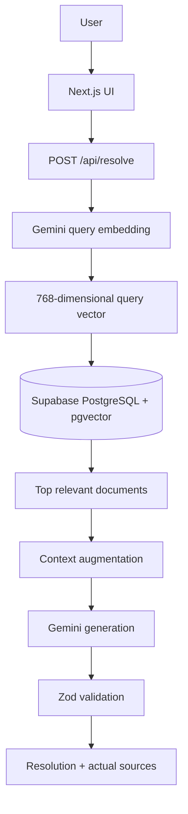

# ResolveAI

AI-powered issue resolution grounded in retrieved support knowledge.

[Live demo](https://resolve-hiz6sanmm-garvit-singhs-projects-91afeb25.vercel.app)

## The problem

Traditional LLM support assistants can answer without company-specific procedures. ResolveAI retrieves relevant support knowledge first, then gives that context to Gemini to produce a structured, source-visible resolution.

## Core features

- Gemini query embeddings with 768-dimensional semantic vectors
- PostgreSQL + pgvector top-K semantic retrieval (top 4, threshold 0.55)
- Retrieval-augmented Gemini generation with structured, Zod-validated output
- Actual vector-search source attribution and escalation when knowledge is insufficient
- Server-only Gemini and Supabase credentials
- Transient Gemini-generation retry (up to two retries with 1s/2s backoff)
- Responsive Next.js interface with accessible loading and error states

## Architecture



### Why this is RAG, not a chatbot wrapper

The issue is embedded, and pgvector retrieves semantically related support documents. Those documents are delimited and added to Gemini’s prompt before generation. Source metadata comes directly from vector retrieval, not the model. This reduces unsupported generation and makes the answer inspectable; it does not eliminate hallucinations.

## Technology

| Layer | Technology | Purpose |
|---|---|---|
| Frontend | Next.js, React, TypeScript, Tailwind CSS | Responsive issue-resolution interface |
| Backend | Next.js Route Handlers | Server API and trust boundary |
| LLM | Gemini via `@google/genai` | Structured resolution generation |
| Embeddings | Gemini Embedding API | Semantic representation of issues and documents |
| Database | Supabase PostgreSQL | Knowledge document storage |
| Vector search | pgvector | Cosine-similarity retrieval |
| Validation | Zod | Request and generated-output validation |
| Deployment | Vercel | Application hosting |

## Local setup

1. Clone this repository and install dependencies:

   ```bash
   npm install
   ```

2. Create `.env.local`:

   ```bash
   GEMINI_API_KEY=
   GEMINI_MODEL=
   GEMINI_EMBEDDING_MODEL=gemini-embedding-001
   SUPABASE_URL=
   SUPABASE_SECRET_KEY=
   ```

   `GEMINI_MODEL` controls the configured generation model. Keep all values server-side; never prefix these variables with `NEXT_PUBLIC_`.

3. In the Supabase SQL Editor, run [supabase/schema.sql](supabase/schema.sql).

4. Seed the 12-document demo knowledge base:

   ```bash
   npm run seed
   ```

5. Start the app and open [http://localhost:3000](http://localhost:3000):

   ```bash
   npm run dev
   ```

## Sample inputs

- “My payment failed but money was deducted.”
- “I reset my password but I still cannot log in.”
- “My API token returns 401 Unauthorized.”

## Project structure

```text
app/         Next.js UI and /api/resolve route
components/  Interactive workspace and result presentation
lib/         Environment, Gemini, embedding, retry, retrieval, and validation logic
data/        Curated support knowledge documents
scripts/     Database seed script
supabase/    Reproducible pgvector schema and RPC
docs/        Engineering and interview documentation
```

## Limitations

- Seeded knowledge documents; no ingestion or chunking pipeline
- Small dataset, fixed 0.55 threshold, and no retrieval evaluation benchmark yet
- No authentication, authorization, or tenant-scoped knowledge bases
- External Gemini availability affects requests; only transient generation failures are retried
- Exact search is sufficient for 12 documents; no ANN index is needed yet

## Future improvements

Document ingestion and chunking, retrieval evaluation, reranking, tenant isolation, authentication, HNSW/IVFFlat indexing at scale, observability, rate limiting, feedback capture, and justified caching.

## Engineering documentation

[PRD](docs/PRD.md) · [HLD](docs/HLD.md) · [LLD](docs/LLD.md) · [Architecture](docs/ARCHITECTURE.md) · [Architecture Decisions](docs/ARCHITECTURE_DECISIONS.md) · [RAG Pipeline](docs/RAG_PIPELINE.md) · [Database Design](docs/DATABASE_DESIGN.md) · [API Documentation](docs/API_DOCUMENTATION.md) · [Security](docs/SECURITY.md) · [Testing Strategy](docs/TESTING_STRATEGY.md) · [Trade-offs](docs/TRADEOFFS.md) · [Interview Guide](docs/INTERVIEW_GUIDE.md)
