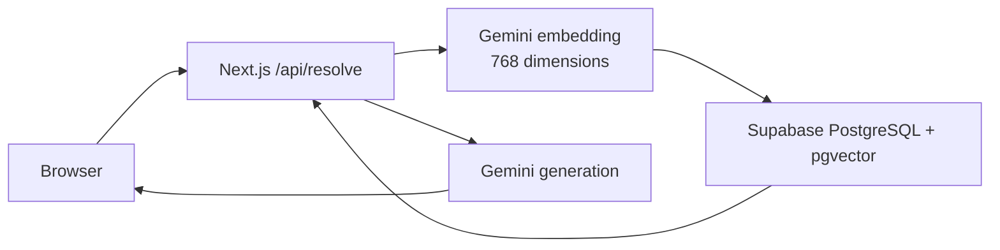

# ResolveAI

AI-powered issue resolution grounded in a Supabase knowledge base.

**Live demo:** add deployment URL · **Screenshot:** add after deployment.

## What it does

A user submits a support issue. The server embeds it with Gemini, searches `public.documents` through the `match_documents` pgvector RPC, gives the top matching documents to Gemini, validates a structured resolution, and returns the actual retrieved sources alongside it.



## Stack and features

- Next.js App Router, React, TypeScript, Tailwind CSS
- Route Handler with Zod request and model-output validation
- Gemini via `@google/genai`; one embedding and one generation per request
- Supabase PostgreSQL, pgvector, and real similarity scores from `match_documents`
- 12 curated support documents and an idempotent seed script
- Source attribution, low-retrieval escalation guidance, responsive accessible UI

## Local setup

```bash
npm install
npm run seed
npm run dev
```

Create `.env.local` with variable names only:

```bash
GEMINI_API_KEY=
GEMINI_MODEL=gemini-3.8-flash
GEMINI_EMBEDDING_MODEL=gemini-embedding-001
SUPABASE_URL=
SUPABASE_SECRET_KEY=
```

The database must provide `public.documents` with `embedding vector(768)` and the `public.match_documents(query_embedding vector(768), match_threshold double precision, match_count integer)` RPC described in the project brief. `npm run seed` removes only these demo documents by title, regenerates document embeddings, and inserts them. Do not expose `.env.local`, the Supabase secret key, or the Gemini key.

## API

`POST /api/resolve` with `{ "issue": "My API token returns 401 Unauthorized." }`. It returns a Zod-validated resolution plus source `id`, `title`, `category`, and real vector `similarity`.

## Verification

`npm run lint` and `npm run build` passed locally. After seeding, try the payment-deducted, password-reset, API-401, subscription-cancellation, and unrelated-question cases listed in [Testing Strategy](docs/TESTING_STRATEGY.md).

## Engineering notes

This is a deliberately small portfolio MVP, not a production support platform. See [PRD](docs/PRD.md), [HLD](docs/HLD.md), [LLD](docs/LLD.md), [Architecture](docs/ARCHITECTURE.md), [ADRs](docs/ARCHITECTURE_DECISIONS.md), [RAG pipeline](docs/RAG_PIPELINE.md), [database](docs/DATABASE_DESIGN.md), [security](docs/SECURITY.md), [testing](docs/TESTING_STRATEGY.md), [trade-offs](docs/TRADEOFFS.md), and the [interview guide](docs/INTERVIEW_GUIDE.md).
