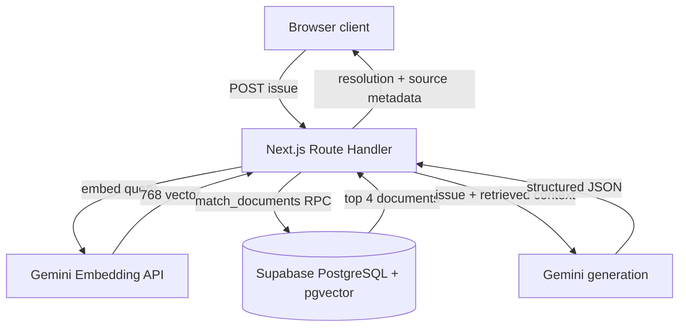

# High-Level Design

The browser is untrusted and only calls `/api/resolve`. The route handler owns all credentials, validates input, calls Gemini and Supabase, validates the model output, and suppresses internal errors. The retrieval layer makes a single RPC call at a 0.55 threshold and returns up to four results. Gemini is an external dependency for both embedding and generation; Supabase is the document store and vector search dependency.

The app deploys as a normal Node-compatible Next.js service with server environment variables. Failure points are malformed client JSON, missing server configuration, Gemini failures, Supabase/RPC failures, empty retrieval, and malformed model JSON. For a small corpus exact search is adequate. At larger scale, add filtering, chunking, observability, rate limiting, and an ANN pgvector index.
