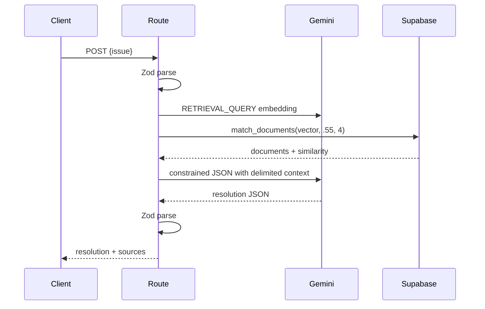

# Low-Level Design

| Module | Purpose, inputs, outputs, errors |
|---|---|
| `lib/env.ts` | Lazily validates five required server variables with Zod; throws clear server-only configuration errors. |
| `lib/gemini.ts` | Reuses one `GoogleGenAI` client initialized with the server API key. |
| `lib/embeddings.ts` | `generateEmbedding(text, taskType, title?)` requests a 768-dimensional vector and rejects missing/wrong-sized embeddings. |
| `lib/supabase-server.ts` | Reuses a privileged server Supabase client with session persistence disabled. |
| `lib/retrieval.ts` | Embeds a query once, calls `match_documents`, and returns database similarity values. |
| `lib/schemas.ts` | Validates the issue and generated resolution shape. |
| `app/api/resolve/route.ts` | Coordinates validation, retrieval, context construction, JSON-constrained generation, output parsing, and HTTP responses. |
| `scripts/seed.ts` | Loads `.env.local`, removes only known demo titles, embeds each source with `RETRIEVAL_DOCUMENT`, and inserts it. |

The separate source mapping prevents the LLM from inventing citations. Each function is intentionally small so input, retrieval, and generation failures surface at the route boundary.
