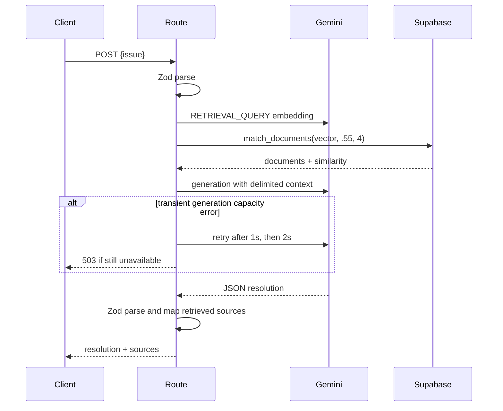

# Low-Level Design

| Module | Actual responsibility |
|---|---|
| `lib/env.ts` | Lazily Zod-validates required server variables. |
| `lib/gemini.ts` | Reuses one `GoogleGenAI` client. |
| `lib/embeddings.ts` | Creates and validates 768-dimensional query/document embeddings. |
| `lib/gemini-retry.ts` | Retries only transient Gemini generation errors twice, with 1s/2s delay. |
| `lib/supabase-server.ts` | Reuses the privileged server Supabase client with no session persistence. |
| `lib/retrieval.ts` | Creates one query vector and calls `match_documents` with `0.55`, `4`. |
| `lib/schemas.ts` | Validates input and generated resolution fields. |
| `app/api/resolve/route.ts` | Coordinates RAG, response mapping, and safe HTTP errors. |
| `scripts/seed.ts` | Loads environment, replaces known demo titles, and embeds/inserts 12 records. |

Retries do not wrap request parsing, embedding, retrieval, output parsing, authentication, permission, or normal permanent 4xx failures. Sources are mapped from retrieval to stop the model from inventing citations.
